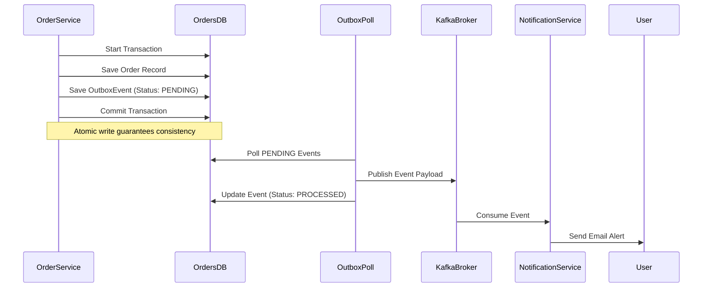

# Distributed Systems & System Design Spec

This document details the advanced system design patterns, caches, and event-driven architectures showcased in the featured projects of Akhil's portfolio.

---

## 🏎 1. Cache-Aside Caching & Event-Driven Invalidation
In the **FinFlow Wealth Management Platform** (Project 2) and our **E-Commerce Platform** (Project 1), we apply cache-aside logic with event-driven invalidation.

```text
User                      API Server                      Redis Cache                     Database
 |                            |                                |                              |
 |--- 1. GET /dashboard ----->|                                |                              |
 |                            |--- 2. Query Cache ------------>|                              |
 |                            |&lt;-- 3. Cache Miss (Null) ------|                              |
 |                            |                                |                              |
 |                            |--- 4. Calculate Aggregate -----------------------------------&gt;|
 |                            |&lt;-- 5. Return Calculated Data &lt;-------------------------------|
 |                            |                                |                              |
 |                            |--- 6. Write Cache -------------&gt;|                              |
 |&lt;-- 7. Returns Dashboard ----|                                |                              |
```

### Event-Driven Invalidation Flow
1. A transaction is posted: `POST /api/expenses`.
2. The transaction service persists it in PostgreSQL and broadcasts a `transaction-created` event to Kafka.
3. The analytics service consumes the event and instantly evicts the dashboard cache from Redis: `RedisCacheManager.evict("dashboards", userId)`.
4. Subsequent fetches hit the database once to rebuild the dashboard, keeping user views fresh without long TTL delays.

---

## 📬 2. Transactional Outbox Pattern
To prevent distributed transaction failures across microservices, we implement the outbox pattern inside the **E-Commerce Platform** (Project 1).



---

## 🔑 3. Edge Perimeter JWT Authentication Flow
Both the E-Commerce and FinFlow architectures utilize centralized edge authentication:

```text
Browser              Spring API Gateway             Eureka Registry              Downstream Services
  |                          |                             |                              |
  |--- 1. Request + JWT ----&gt;|                             |                              |
  |                          |--- 2. Resolve Service -----&gt;|                              |
  |                          |&lt;-- 3. Returns IP / Host ----|                              |
  |                          |                             |                              |
  |                          |--- 4. Validate Token -------|                              |
  |                          |--- 5. Attach Headers -------------------------------------&gt;|
  |                          |       (X-User-Id, X-User-Role)                             |
  |                          |&lt;-- 6. Returns Payload &lt;------------------------------------|
  |&lt;-- 7. Returns response --|                             |                              |
```
1. Client sends request to `api.brand.com/orders` with token.
2. Gateway intercepts and verifies JWT using public keys (RS256).
3. On success, Gateway injects custom headers: `X-User-Id` and `X-User-Role` and routes to order-service.
4. Downstream microservices parse headers directly, avoiding public-key checks, optimizing request paths.
